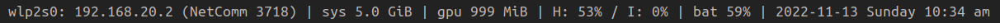

# blstatus

A status monitor for [DWM](https://dwm.suckless.org/) (or any window manager that uses WM_NAME to fill a status bar).
Compared to [slstatus](https://tools.suckless.org/slstatus/), blstatus is capable of displaying more information, and it also updates network, audio volume, and battery information asynchronously, rather than using polling.



## Dependencies

blstatus is written for Python 3 and depends on the following Python modules:

- apscheduler
- pydbus
- xlib
- asyncio-glib
- pulsectl-asyncio

apscheduler, pydbus, and xlib are available in Ubuntu's package repositories:

```bash
sudo apt install python3-apscheduler python3-pydbus python3-xlib
```

asyncio-glib and pulsectl-asyncio are available from the Python package index:

```bash
pip3 install asyncio-glib pulsectl-asyncio
```

### statuscmd

blstatus also supports signals for [statuscmd](https://dwm.suckless.org/patches/statuscmd/), which can be disabled in
config.py.

## Configuration

config.py has a number of variables for configuration.

### `spacer`

The text that's placed between the output of different modules.

### `enable_signal_text`

Allows for disabling the signal text strings used for [statuscmd](https://dwm.suckless.org/patches/statuscmd/).

### `date_time_format`

The format string to pass to the `date` command.

### `memory_interval`

The interval in seconds between updating memory status.

### `memory_enable_gpu`

Allows for disabling the GPU memory status, which uses `nvidia-smi`.

### `battery_conservation_mode_path`

A path to a file that indicates if battery conservation mode is active.
Use an empty string to disable checking for battery conservation mode.

### `battery_conservation_mode_full_percent`

The percentage above which the battery is considered full in battery conservation mode.

### `volume_source_sink_abbreviations`

A [Python dictionary](https://docs.python.org/3/tutorial/datastructures.html#dictionaries) that maps the suffix of a
Pulse sink/source name to an abbreviation, e.g. `'analog-stereo': 'I'`.

The sink/source names can be printed with:

```python
import pulsectl

pulse = pulsectl.Pulse()
print([sink.name for sink in pulse.sink_list()])
print([source.name for source in pulse.source_list()])
```

### `volume_source_sink_unknown_abbreviation`

The abbreviation to use if a sink/source name doesn't match anything in `volume_source_sink_abbreviations`.
